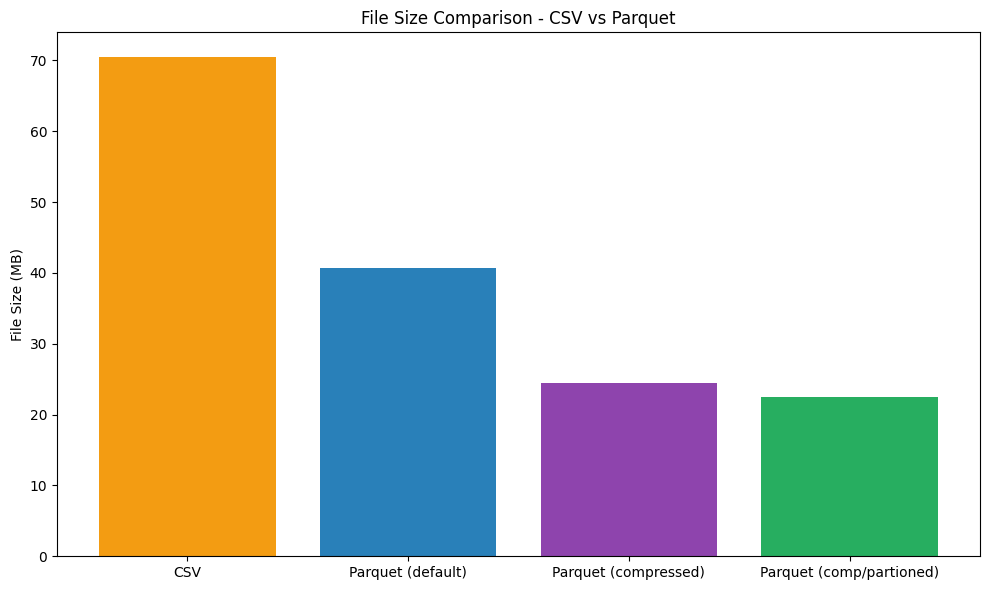
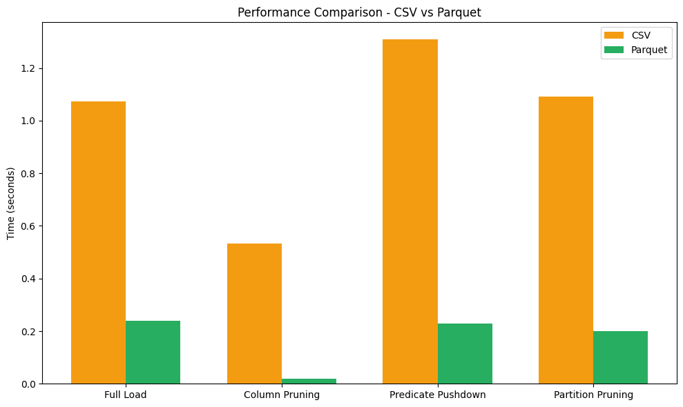

# Apache Parquet vs CSV - Benchmarking and Visualization

[](LICENSE) [](https://www.python.org/) [](https://pandas.pydata.org/) [](https://fastparquet.readthedocs.io/) [](https://matplotlib.org/) 

This project demonstrates the performance advantages of Apache Parquet over CSV format for data storage and processing. Using the "Best Books Ever" dataset, it compares file sizes, read performance, and advanced features like column selection, predicate pushdown and partition pruning.

## ✨ Features

- **File Size Comparison**: Compare storage efficiency between CSV and different Parquet formats
- **Performance Benchmarking**: Measure read times for various data access patterns
- **Column Selection**: Demonstrate columnar storage advantages for partial data reads
- **Predicate Pushdown**: Show how Parquet can filter data during read operations
- **Partition Pruning**: Illustrate performance benefits of partitioned datasets
- **Compression Analysis**: Compare default vs compressed Parquet formats
- **Visualizations**: Generate charts showing performance differences

## 📂 Project Structure

```
apache-parquet-demo/
├── data/
│   ├── books.csv                    # Source CSV dataset (must be downloaded)
│   ├── books_default.parquet        # Default Parquet format (generated)
│   ├── books_compressed.parquet     # Snappy-compressed Parquet (generated)
│   ├── books_partitioned/           # Language-partitioned dataset (generated)
│   └── README.md                    # Data source information
├── parquet_vs_csv_benchmark.ipynb   # Main benchmarking notebook
├── requirements.txt                 # Python dependencies
├── LICENSE                          # MIT License
└── README.md                        # This file
```

## 📋 Requirements

- Python 3.13 or later
- Required Python packages listed in [requirements.txt](requirements.txt)
- Dataset: Books CSV file from [Zenodo - Best Books Ever Dataset](https://zenodo.org/records/4265096)

## 📦 Installation

1. **Clone the repository**:
   ```bash
   git clone https://github.com/albertopd/apache-parquet-demo.git
   cd apache-parquet-demo
   ```

2. **Create a virtual environment** (recommended):
   ```bash
   python -m venv .venv
   source .venv/bin/activate  # On Windows: .venv\Scripts\activate
   ```

3. **Install dependencies**:
   ```bash
   pip install -r requirements.txt
   ```

4. **Download the dataset**:
   - Visit [Zenodo - Best Books Ever Dataset](https://zenodo.org/records/4265096)
   - Download the `books.csv` file
   - Place it in the `data/` directory

## 🚀 Usage

1. **Start Jupyter Notebook**:
   ```bash
   jupyter notebook parquet_vs_csv_benchmark.ipynb
   ```

2. **Run the benchmark**:
   - Execute all cells in order to see the complete analysis
   - The notebook will automatically create Parquet files in different formats
   - View performance comparisons and file size charts

### What the Benchmark Tests

#### File Size Comparison

- **CSV**: Original format
- **Parquet (default)**: Uncompressed Parquet
- **Parquet (compressed)**: GZip compression
- **Parquet (partitioned)**: Partitioned by language (and GZip compressed)

#### Performance Tests

1. **Full dataset loading**: Complete file read performance
2. **Column selection**: Reading only specific columns (title, author, rating)
3. **Predicate pushdown**: Filtering books with rating > 4.5
4. **Partition pruning**: Reading only English books from partitioned dataset

## 📝 Example Output

### File Size Reduction

Typical results show significant storage savings:

```
=============== File Size Comparison ==============
CSV                       70.43 MB
Parquet (default)         40.66 MB  (42.3% smaller)
Parquet (compressed)      24.40 MB  (65.4% smaller)
Parquet (comp/partioned)  22.48 MB  (68.1% smaller)
```

### Performance Improvements

Benchmark results demonstrate Parquet's advantages:

```
=================== Load Full Dataset ====================
CSV                                           Time: 1.219s
Parquet                                       Time: 0.202s
========================= Parquet is 83.4% faster than CSV

===== Load Subset of Columns (title, author, rating) =====
CSV - Column Subset                           Time: 0.563s
Parquet - Column Pruning                      Time: 0.020s
========================= Parquet is 96.4% faster than CSV

============= Load Rows Where: rating > 4.5 ==============
CSV - Filter Rows After Load                  Time: 1.265s
Parquet - Predicate Pushdown                  Time: 0.228s
========================= Parquet is 82.0% faster than CSV

========= Load Rows Where: language == 'English' =========
CSV - Filter Rows After Load                  Time: 1.313s
Parquet - Partition Pruning                   Time: 0.235s
========================= Parquet is 82.1% faster than CSV
```

### Visual Charts





## 🎯 Key Takeaways

- **Storage**: Parquet typically reduces file size by 65-75%
- **Speed**: Column-oriented access is significantly faster
- **Features**: Parquet supports advanced query optimizations

## 📜 License

This project is licensed under the [MIT License](LICENSE).

## 👤 Author

[Alberto Pérez Dávila](https://github.com/albertopd)